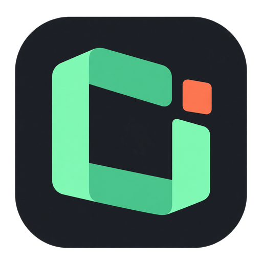

<div align="center">
  
  <h1>AgentPaw · AI Desktop Companion — Codex &amp; Claude Code Desktop Pet</h1>
  <p><strong>A customizable Windows AI desktop pet, coding agent companion, and usage monitor for Codex and Claude Code.</strong></p>
  <p>Codex task notifications, subscription quota monitoring, token usage, and water and stretch reminders.</p>
  <p>Supports Codex, Claude Code, TRAE, WorkBuddy, opencode, and ZCode.</p>

  <p>
    <a href="README.md">简体中文</a> ·
    <a href="README_EN.md">English</a>
  </p>
  <p>
    <a href="https://github.com/vista-zhangg/codex-desktop-pet/releases/latest"><strong>Download for Windows</strong></a> ·
    <a href="docs/releases/1.9.0.md">1.9.0 release notes</a> ·
    <a href="docs/介绍.md">User guide (中文)</a>
  </p>

  <p>
    <a href="https://github.com/vista-zhangg/codex-desktop-pet/actions/workflows/ci.yml"></a>
    
    
    <a href="LICENSE"></a>
  </p>
</div>

> [!IMPORTANT]
> AgentPaw currently supports **Windows x64 only**. macOS, Linux, and Windows on ARM are not supported. Documentation is available in Chinese and English; the application UI is currently Simplified Chinese. The Windows binaries are not commercially code-signed yet, so SmartScreen may display a warning on first launch.

**AgentPaw · AI Desktop Companion** is an independent open-source project, not affiliated with OpenAI or Anthropic. It combines a Codex desktop pet, Claude Code companion, task notifications, and an agent usage monitor. The executable is `AgentPaw.exe`; data lives in `~/.agentpaw/`. First launch copies settings, characters, and history from earlier versions while keeping the original data as a recovery backup.

## What it does

**Free and non-profit, built for personal desktop companionship, learning, and sharing.** No paid character packs or paid downloads. Third-party artwork is separate from the MIT-licensed code; see [creator accounts, credits, and artwork terms](assets/CREDITS.md).

Keep Codex progress, 5h / 7d subscription quota, and token usage on your desktop, alongside sessions from your other AI coding tools. AgentPaw asks for attention when a task needs you and celebrates completed turns. Water, stretch, and eye-rest reminders follow your time at the computer even when no AI task is running, in both character and compact capsule modes.

- **One companion, six agents** — Codex, Claude Code, TRAE, WorkBuddy, opencode, and ZCode.
- **Multiple characters and custom GIF pets** — switch characters, create one from an idle GIF, or import an entire state pack. Each character keeps independent edits and reset defaults.
- **Status at a glance** — working, thinking, parallel tasks, compaction, permission waits, user input, completion, errors, breaks, and sleep; background tasks and scheduled wakeups stay active until they actually clear.
- **Custom expressions** — browse every state GIF, add rotating variants, replace or remove a selected item, or restore defaults.
- **Native permission cards** — allow, deny, or permanently allow supported Claude Code requests from the pet.
- **Unified usage view** — tokens, cache reads and writes, context windows, models, daily trends, and API-price estimates.
- **Check Codex quota without opening Codex** — startup automatically discovers the native Codex Desktop CLI. The tray uses the independent AgentPaw brand icon; right-click the AgentPaw tray icon to see the masked current account, 5h / 7d remaining quota, reset times, and the last update. Missing windows stay `--`, with no manual setup required.
- **Integration health and repair** — verify all six agents, then repair or remove AgentPaw-managed integrations from Settings.
- **One-click privacy mode** — right-click the companion to toggle the compact ON/OFF control, or use Settings, while keeping essential state and usage visible.
- **Local-first operation** — conversations and usage stay on the machine; models.dev supplies public pricing while Codex authenticates and reads its own subscription quota.
- **Desktop-friendly controls** — drag, edge snapping, work peek, action center, system tray, auto-start, and scheduled break animations.
- **Reminders for your workday** — water, stretch, and eye-rest reminders run independently of AI activity in both character and capsule modes. Set each interval and snooze duration, turn reminders on or off individually or together, or skip a reminder for today.
- **Fullscreen and temporary quiet** — hide automatically during fullscreen use and restore afterward, or stay quiet for 15 / 30 / 60 minutes or a custom duration. Both modes share the existing window-hiding behavior while monitoring continues in the background. A manually hidden companion stays hidden until you explicitly show it.

## Real state examples

Built-in characters include **Salary Cat**, **Milk Tea Mouse (BOBARAT)** and **Mimi Bee (小蜜蜂蜜蜜)**. Milk Tea Mouse was created by **Achi (阿翅)**; the official account is **奶茶鼠的想法**. See [full attribution](assets/characters/milktea-mouse/CREDITS.md). Mimi Bee was created by **花栗鼠发发**, formerly known as **花栗鼠 Toby**; see [creator credits and sources](assets/characters/mimi-bee/CREDITS.md). Custom character packs use the same task states.

| Salary Cat · Working | Milk Tea Mouse · Working | Mimi Bee · Greeting |
| --- | --- | --- |
|  |  |  |

<table>
  <tr>
    <td align="center"><br><strong>Working</strong><br><sub>A tool is running</sub></td>
    <td align="center"><br><strong>Thinking</strong><br><sub>The model is reasoning</sub></td>
    <td align="center"><br><strong>Parallel</strong><br><sub>Several tasks are active</sub></td>
    <td align="center"><br><strong>Permission</strong><br><sub>Your decision is required</sub></td>
  </tr>
  <tr>
    <td align="center"><br><strong>Completed</strong><br><sub>A turn has finished</sub></td>
    <td align="center"><br><strong>Error</strong><br><sub>A session needs attention</sub></td>
    <td align="center"><br><strong>Between tools</strong><br><sub>Waiting for the next event</sub></td>
    <td align="center"><br><strong>Resting</strong><br><sub>No active task</sub></td>
  </tr>
</table>

> Third-party characters are not covered by the code's MIT License. See [cat artwork attribution](assets/cat/CREDITS.md), [milk tea mouse artwork notes](assets/characters/milktea-mouse/CREDITS.md), and [Mimi Bee artwork notes](assets/characters/mimi-bee/CREDITS.md). The application icon is independent of character artwork.

## Custom state expressions

Open Settings → **Characters & expressions**, choose a character, and browse every work, feedback, and ambient state. You can also create a custom pet or [import a character pack](docs/character-packs.md). For the selected state you can:

- keep the current expressions and **add a rotating variant**;
- select any built-in or custom GIF in the playlist and replace or remove only that item; built-in files and imported source files are never deleted;
- keep at least one GIF per state, or restore all of the state's built-in defaults at once.

Imports are fitted to AgentPaw's 120 × 120 pet canvas. Transparent backgrounds are preserved, while a detached solid-color border is removed when it can be detected safely. Complex backgrounds are kept to avoid damaging the subject, with a warning shown in Settings. Limits are 12 MB, 2048 × 2048, 180 frames, and 60 seconds per GIF; each state accepts up to 20 custom expressions.

AgentPaw stores only a processed copy under `~/.agentpaw/pet-assets` for the current user. It never changes or deletes the source file, and saved expressions update the visible pet immediately without a restart. Users are responsible for the rights to assets they import.

## Support matrix

| Agent | Integration | External configuration | In-pet approval |
| --- | --- | --- | --- |
| Codex | Incremental local rollout JSONL reader; official App Server quota notifications | Does not modify Codex configuration or read credential files | Read-only alerts |
| Claude Code | Lifecycle hooks, transcript, and process data | Merge-safe AgentPaw hook install/uninstall | Supported |
| TRAE | Local IDE logs and process data | Installs a merge-safe hook only when TRAE is detected | Read-only alerts |
| WorkBuddy | Hooks, transcripts, and usage fields | Installs a merge-safe hook only when WorkBuddy is detected | Read-only alerts |
| opencode | Official plugin mechanism, events, and usage file | Installs/removes one standalone plugin file | Read-only alerts |
| ZCode | Lifecycle hooks via `hook/zcode-hook.js` (event name arrives in the stdin payload) and a read-only poller over ZCode's `model_usage` SQLite ledger | Merge-safe install/uninstall of the hook block in `~/.zcode/cli/config.json` | Read-only alerts |

On first launch, AgentPaw only integrates with tools already used by the current Windows account. It does not create configuration folders for undetected agents. Codex is always read-only and requires no hook.

## Install and run

### Release builds

Download the installer from the [latest release](https://github.com/vista-zhangg/codex-desktop-pet/releases/latest):

- `AgentPaw-<version>-Windows-x64.exe` — the only supported Windows x64 NSIS installer.

Starting with 1.7.0, releases do not offer source/npm deployment or a portable ZIP. Install the EXE before use; do not run the app directly from an archive or source checkout.

### Development and contribution

Source startup, testing, and local packaging commands are for developers and contributors only; see the [local development and packaging guide](docs/LOCAL_DEPLOYMENT.md).

## Developer commands

Developer `npm` commands, regression tests, and the EXE packaging flow are documented in the [local development and packaging guide](docs/LOCAL_DEPLOYMENT.md).

## Data and privacy

- Configuration, runtime tokens, pricing cache, and usage ledgers live in `~/.agentpaw/`.
- Claude Code, Codex, TRAE, WorkBuddy, opencode, and ZCode session data is read and processed locally.
- The local HTTP service binds to loopback only, and write endpoints require a fresh per-run token.
- models.dev synchronization downloads a public price list only; transcripts, rollouts, permission contents, and usage statistics are not uploaded.
- Codex quota uses one long-lived `codex app-server --stdio` connection. AgentPaw confirms the current account with `account/read` before reading quota and listening for updates. Codex owns authentication and upstream requests; AgentPaw does not read the contents of `~/.codex/auth.json` or call ChatGPT web endpoints. With file auth, replacing `auth.json` triggers an immediate reconnect. Keyring, auto, and ephemeral auth have no watchable file-event contract, so account changes converge through App Server account notifications, periodic `account/read`, and scheduled connection recycling. The UI therefore represents the account visible to AgentPaw's own App Server connection; it does not promise that a non-file auth switch in another process is detected immediately by the file watcher.
- Privacy mode from the cat menu or Settings masks on-screen details only; local monitoring and usage accounting continue, and pending items return when it is disabled.
- Displayed cost is an estimate based on public API prices, not a subscription bill or a provider’s final invoice.

See [Privacy and data boundaries](docs/PRIVACY.md) for the complete bilingual policy.

## How it works

```text
Claude hooks ─────┐
Codex rollouts ───┼──> local server / watchers ──> adapter / core ──> pet + details panel
TRAE logs ────────┤                                      └────────> unified usage ledger
WorkBuddy ────────┤
opencode plugin ──┤
ZCode hook/DB ────┘
Codex App Server ─────> tray context menu (5h / 7d) + low-quota bubble
```

The main process owns watcher lifecycles, the tray, and windows. The backend state machine aggregates concurrent sessions. Renderers only receive a reduced status and event protocol. State vocabulary and priority are defined once in [`shared/states.js`](shared/states.js).

## Documentation

- [Chinese user guide](docs/介绍.md)
- [Chinese local deployment and packaging guide](docs/LOCAL_DEPLOYMENT.md)
- [Release process and compatibility policy](docs/RELEASE.md)
- [State machine and rendering specification](STATES.md)
- [Privacy and data boundaries — bilingual](docs/PRIVACY.md)
- [Contributing guide — bilingual](CONTRIBUTING.md)
- [Security policy — bilingual](SECURITY.md)

## Origin and licensing

AgentPaw is derived from [LLMPET](https://github.com/myunwang/LLMPET), with substantial work on Windows desktop behavior, multi-agent integrations, unified usage reporting, settings, and project structure.

- Source code is released under the [MIT License](LICENSE).
- The root license retains the upstream `Copyright (c) 2026 myunwang` notice.
- AgentPaw modifications remain copyright of their respective contributors.
- Third-party character GIFs and derived avatars remain the property of their respective owners and are not covered by the code's MIT License. Original attribution is retained in the asset directories.

## Contributing

Bug reports, Windows compatibility improvements, and new agent integrations are welcome. Read [CONTRIBUTING.md](CONTRIBUTING.md) before submitting changes. Report vulnerabilities privately as described in [SECURITY.md](SECURITY.md).

---

<div align="center">
  <sub>Codex desktop pet &amp; companion · Windows x64 · Local-first · Six AI coding tools.</sub>
</div>
